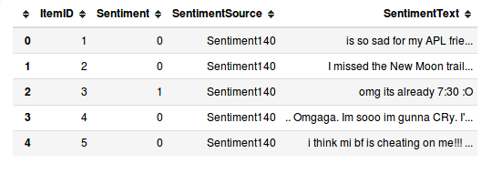
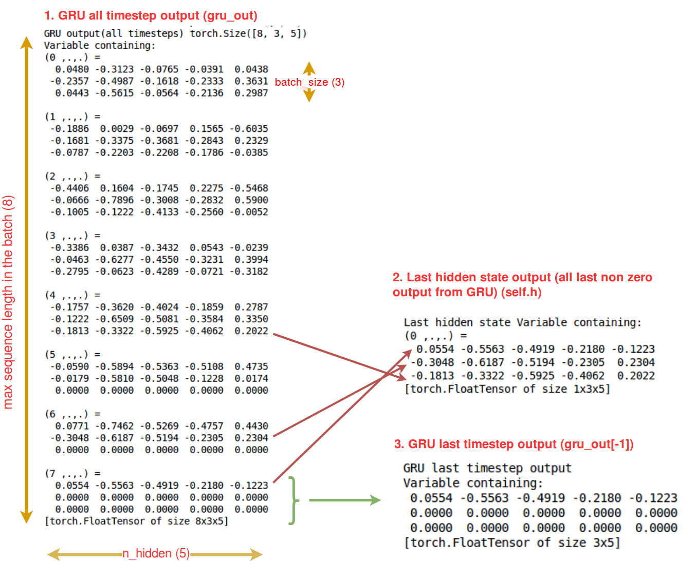
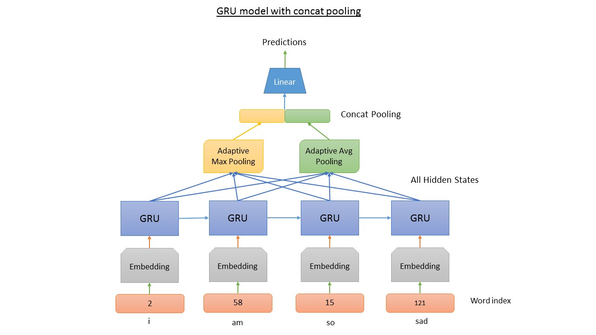

# Sentiment Analysis with Variable Length sequences in pytorch

This repo contains the code for the this blog.  
Our final aim is to build a simple GRU model with concat pooling [5]. For this post I will use Twitter Sentiment Analysis [1] dataset as this is a much easier dataset compared to the competition. Download dataset from [2]

> This post focuses on how to implement sequence classification with variable lengths in pure pytorch.

## Prerequisites
* Basic knowledge of [Pytorch 0.3.1](http://pytorch.org/)
* Understanding of GRU/LSTM [4]

## What is covered in the [notebook](Sentiment%20analysis%20pytorch.ipynb)

1. Load Data
2. Simple Data Analysis
3. Build Vocabulary and tokenize
4. Unpadded dataset and dataloader
5. Padded dataset and dataloader
6. Simple GRU model
6. GRU model with concat pooling
7. Max Pooling and Average Pooling
8. Train

## Data Overview

## Output from GRU and hidden state

## Concat Pooling model architecture [5]

## ToDo
- [ ] Add function to make train/validation split
- [ ] Use pretrained embedding
- [ ] Use bidirectional GRU

## References
[1] http://thinknook.com/twitter-sentiment-analysis-training-corpus-dataset-2012-09-22/  
[2] http://thinknook.com/wp-content/uploads/2012/09/Sentiment-Analysis-Dataset.zip  
[3] https://stackoverflow.com/questions/46387661/how-to-correctly-implement-a-batch-input-lstm-network-in-pytorch  
[4] https://colah.github.io/posts/2015-08-Understanding-LSTMs/  
[5] https://arxiv.org/abs/1801.06146
